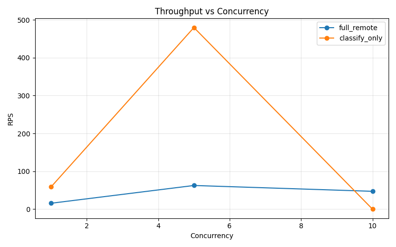
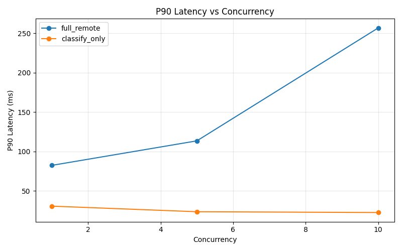
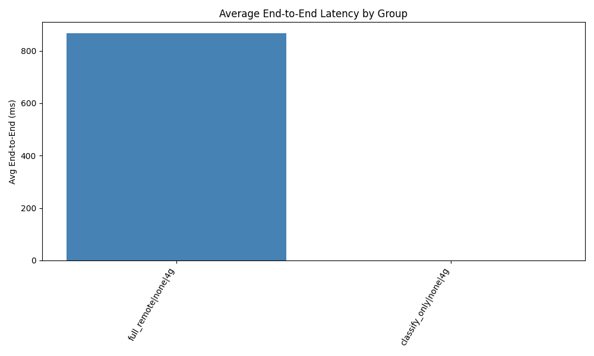
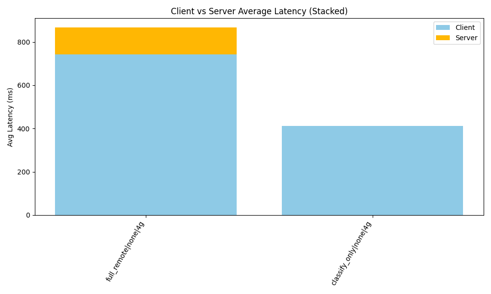

#  漆面缺陷检测系统

##  项目简介

漆面缺陷检测系统是一个基于机器学习的智能检测工具，能够自动识别漆面表面的各种缺陷，如划痕、气泡、污点等。系统采用计算机视觉技术和支持向量机(SVM)算法，实现高效准确的缺陷检测。

###  主要特性
-  **智能检测**: 自动识别漆面缺陷
-  **快速处理**: 实时检测，响应迅速  
-  **高准确率**: 基于机器学习算法
-  **Web界面**: 友好的用户交互界面
-  **可视化结果**: 直观展示检测过程

##  系统架构

### 技术栈
- **后端**: Python + Flask
- **机器学习**: OpenCV + scikit-learn
- **前端**: HTML + CSS + JavaScript
- **算法**: SVM (支持向量机)

### 核心模块
- `train.py` - 模型训练脚本
- `inference.py` - 推理检测模块
- `app.py` - Web应用入口
- `test_model.py` - 模型测试工具

##  数据集下载

### 数据集信息
- **数据来源**: [通用瑕疵集合]
- **图片数量**: 575张训练图片
- **图片尺寸**: 512×512像素
- **标注格式**: YOLO格式 (.txt文件)

### 下载地址
 [点击下载漆面缺陷数据集](  https://gitcode.com/open-source-toolkit/1ce67  )


##  快速开始

### 环境要求
- Python 3.8+
- OpenCV 4.5+
- scikit-learn 1.0+
- Flask 2.0+

### 安装步骤

1. **克隆项目**
   
```markdown
git clone https://github.com/tonewworld/PaintDefect.git
cd PaintDefect
```

2. **安装依赖**

```markdown
python -m venv venv
venv\Scripts\activate     # Windows
pip install -r requirements.txt
```

4. **准备数据集**

下载数据集并解压到 dataset/train/

确保包含 .png 图片和对应的 .txt 标注文件

最终目录结构：
```markdown
PaintDefect/
├── .gitignore
├── dataset/
│ ├── train/
│ └── valid/
├── model/
├── output/
├── static/
│ └── uploads/
├── test_images/
├── templates/
├── app.py
├── inference.py
├── train.py
├── test_model.py
├── requirements.txt
└── README.md
```

4. **运行训练脚本**

```markdown
python train.py
```

训练参数
图片尺寸: 512×512

特征维度: 15维

算法: SVM with RBF kernel

数据平衡: 自动上采样

5. **启动服务**

```markdown
python app.py
```
本地端口:http://127.0.0.1:5000

## 分区与性能测试 (A/B/C 部分实现)

本项目已扩展支持多种“计算任务分区”模式，以用于研究移动端与云端的协同：

### A. 选择的计算密集 & 时延敏感应用
漆面缺陷检测：包含图像预处理 (自适应阈值、边缘、形态学)、特征提取 (Hu 矩、轮廓、纹理、梯度) 与 SVM 分类，图像分辨率 512×512，适合测试端侧 vs 云端的延迟差异。

### B. 模块划分与性能因素
核心阶段：
- 预处理阶段 (preprocess)
- 特征提取阶段 (feature)
- 分类阶段 (predict)

通过接口 `/predict` 的 `timing` 字段返回各阶段耗时 (ms)。影响性能的关键因素：
- 图像尺寸与压缩质量 (影响上传与预处理耗时)
- 服务器 CPU 负载 (影响所有阶段执行时间)
- 网络带宽与 RTT (影响文件上传/特征上传时延)
- 分区模式选择 (是否在客户端计算特征或分类)

### 分区模式说明
| 模式 | 描述 | 适用场景 |
|------|------|----------|
| full_remote | 服务端执行完整流水线 | 端侧资源有限或网络良好 |
| classify_only | 客户端已抽取特征，仅服务端分类 | 降低上传体积，端侧具备特征提取能力 |
| auto | 简易策略，根据 CPU 与文件大小决定（当前版本仍默认 full_remote，可扩展） | 动态调度演示 |

使用 `FormData` 发送 `mode` 参数即可指定模式。

#### 请求与响应示例

- full_remote（上传整图，执行完整流程）：

请求（multipart/form-data 发到 `/predict`）：
```bash
curl -X POST http://127.0.0.1:5000/predict \
	-F "file=@dataset/train/0576.PNG" \
	-F "mode=full_remote"
```

响应（字段示例）：
```json
{
	"label": "defect",               
	"score": 0.92,                    
	"mode": "full_remote",
	"timing": {
		"preprocess_ms": 25.4,
		"feature_ms": 13.2,
		"predict_ms": 2.3,
		"total_ms": 41.7,               
		"endpoint_ms": 68.9             
	},
	"advisory": {                      
		"recommended_mode": "classify_only",
		"reason": "avg_file=712345, cpu=62.3, avg_server=271.5"
	}
}
```

- classify_only（仅上传特征，服务端分类）：

优先使用 `/classify`（application/json），也可对 `/predict` 传 `mode=classify_only` + JSON：

请求（发到 `/classify`）：
```bash
curl -X POST http://127.0.0.1:5000/classify \
	-H "Content-Type: application/json" \
	-d '{"features": [0.1,0.2,0.3,0.4,0.5,0.6,0.7,0.8,0.9,1,1.1,1.2,1.3,1.4,1.5]}'
```

响应（字段示例）：
```json
{
	"label": "defect",
	"score": 0.88,
	"mode": "classify_only",
	"timing": { "predict_ms": 2.1 }
}
```

字段说明：
- `label`/`score`: 分类结果与置信度（示例字段，实际以模型实现为准）。
- `timing.preprocess_ms`/`feature_ms`/`predict_ms`/`total_ms`: 服务端阶段耗时；`endpoint_ms` 为该 HTTP 请求在服务端端点整体耗时。
- `advisory`: 当请求 `mode=auto` 时返回建议模式与理由；当前实现不强制改写执行模式，便于客户端自行决策。

#### 前端行为与常见问题

- classify_only 的前端行为：浏览器端使用 OpenCV.js 提取特征，仅将特征向量（JSON）POST 到 `/classify`，不会上传整图。
- auto 的前端行为：仍将整图上传到 `/predict`，由服务端返回 `advisory.recommended_mode`，前端可据此切换模式。
- 常见错误“需要提供 features 数组”：通常是页面使用了旧版本脚本（PWA 缓存/浏览器缓存）、或 OpenCV.js 未加载成功，导致前端仍把图片发到 `/predict`。
	- 处理步骤：
		- 强制刷新页面或清除站点数据/Service Worker 缓存后重试；
		- 确认网络面板中看到 `POST /classify` 且请求体包含 `features` 字段；
		- 若提示 OpenCV.js 未加载，请等待脚本加载或检查网络。

### C. 动态运行时决策
当前 `auto` 策略：采样服务器 CPU 利用率与请求体大小，可扩展为：
1. 引入网络测速 (客户端定期 ping)
2. 服务端排队长度 (请求并发数)
3. 历史耗时回归模型，动态阈值调整

可在后续版本中将特征提取的 OpenCV 实现迁移到 WebAssembly / 移动原生模块，真实实现 classify_only 模式。

### 前端支持
`templates/index.html` 增加“分区模式选择”下拉框与时间分解展示。

### 基准测试脚本
使用 `benchmark.py` 批量发送图片并统计不同模式的端到端时延：

```bash
python benchmark.py --server http://127.0.0.1:5000 --images dataset/train --modes full_remote auto --repeat 3 --limit 5
```

输出示例：
```json
{
	"full_remote": {"count": 15, "avg_ms": 210.4, "median_ms": 205.8, "min_ms": 180.2, "max_ms": 260.9},
	"auto": {"count": 15, "avg_ms": 212.7, "median_ms": 207.3, "min_ms": 181.5, "max_ms": 265.1}
}
```

### 数据记录建议
将脚本输出重定向保存：
```bash
python benchmark.py --server http://127.0.0.1:5000 --images dataset/train --modes full_remote auto --repeat 5 > output/bench_full_auto.json
```

### 扩展方向
- 更精细的自动策略 (强化学习/多臂赌博)
- 端侧特征提取 WebAssembly 化
- 上传增量差异 (delta) 而非全图
- 模型升级为深度学习轻量模型 (MobileNet) 并再评估分区策略

## 接口速览
| 路径 | 方法 | 说明 |
|------|------|------|
| /predict | POST | 上传图片+mode，返回预测与时间分解 |
| /classify | POST | 仅提交特征数组进行分类 |

`/classify` 示例：
```bash
curl -X POST http://127.0.0.1:5000/classify -H "Content-Type: application/json" -d '{"features": [0.1,0.2,0.3,0.4,0.5,0.6,0.7,0.8,0.9,1,1.1,1.2,1.3,1.4,1.5]}'
```

## 并发与模式对比

- 全流程并发压测：
```bash
python benchmark_concurrent.py --server http://127.0.0.1:5000 --images dataset/train --concurrency 1 5 10 --duration 30 --mode full_remote --out full_remote_conc.json
```

- classify_only 并发压测（先本地抽取特征，再 POST /classify）：
```bash
python benchmark_classify_only.py --server http://127.0.0.1:5000 --images dataset/train --concurrency 1 5 10 --duration 30 --limit 50 --out classify_only_conc.json
```

- 汇总并生成图表：
```bash
python summarize_concurrency.py --files full_remote_conc.json classify_only_conc.json --outdir output/conc
```
生成：`output/conc/conc_summary.csv`、`rps_vs_concurrency.png`、`p90_vs_concurrency.png`。


### 可视化

并发对比图表（已由脚本生成）：





> 数据表见 `output/conc/conc_summary.csv`。

### 结论小结

- classify_only 明显优于 full_remote（c=1、c=5）：RPS 提升约 3–7×，P90 时延降低至 20–30ms 区间。
- c=10 时 classify_only 出现失败激增，推测为服务端/客户端过载或请求队列限制所致；建议将客户端并发≤5，或提升后端线程/队列与超时配置。
- full_remote 随并发增大受上传与服务端计算影响，P90 在 c=10 明显上升（>250ms）。
- 实践建议：在当前网络与服务器配置下，优先选择 classify_only（并发≤5）；结合 `/decision` 接口做动态切换与回退。

## 移动端端到端性能

基于手机网页端采集的端到端日志可视化如下（由 `analyze_mobile_logs.py` 与 `visualize_logs.py` 生成）：





结论要点：
- full_remote 下，上传耗时占比较高，网络状况对端到端影响显著。
- classify_only 下，客户端特征提取增加少量本地开销，但显著减少上传体积与总体时延。
- 可通过调节前端压缩质量、分辨率与批处理策略进一步优化端到端时延。


